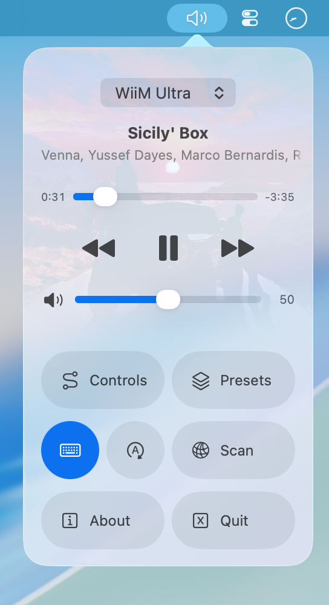
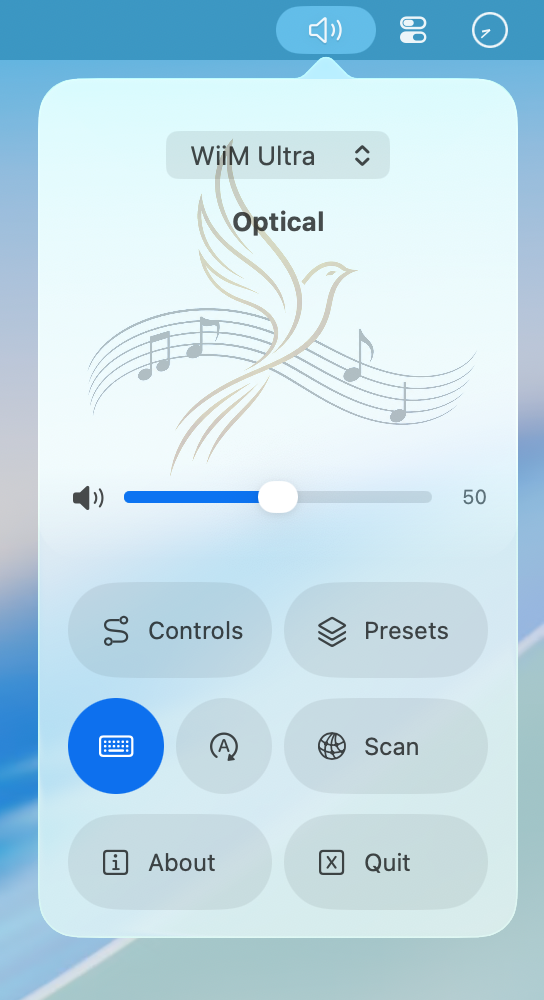
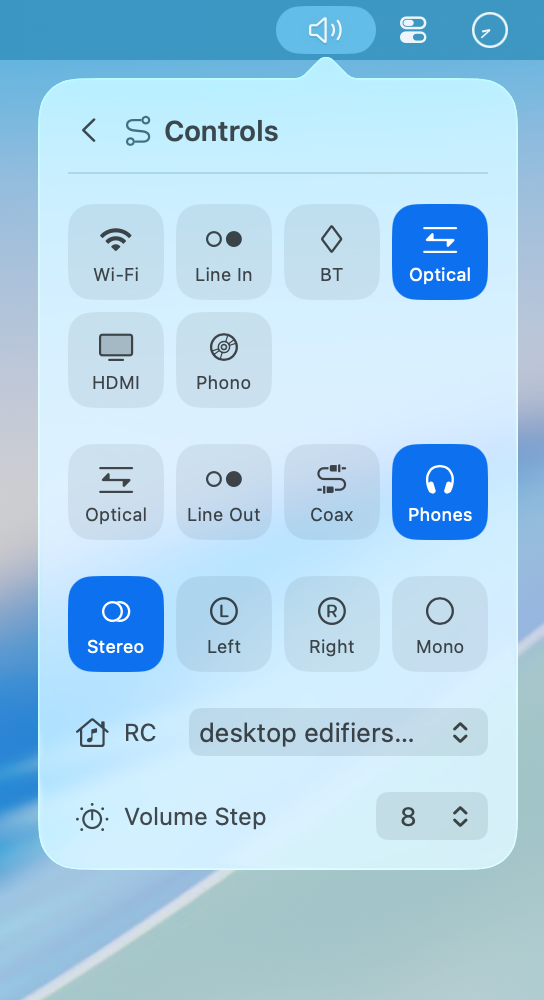
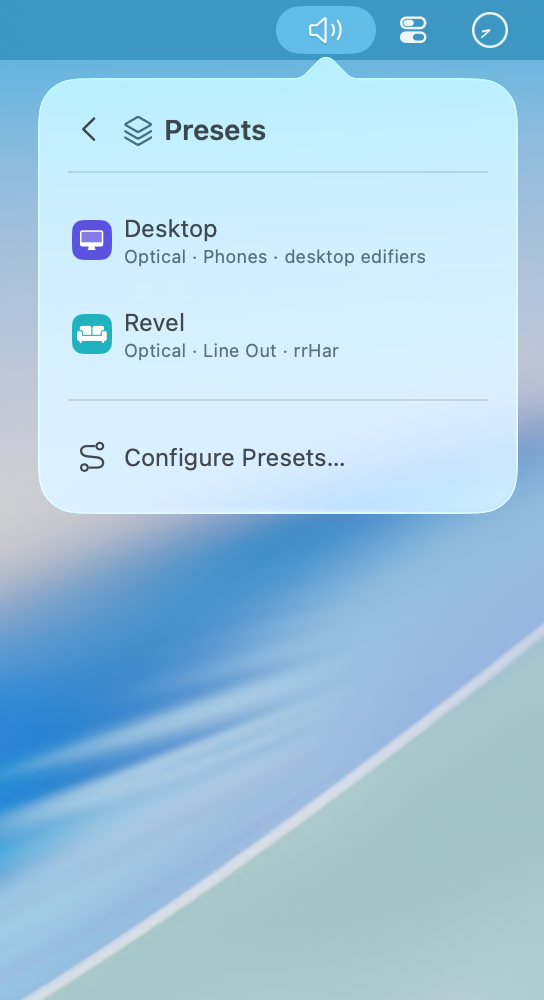
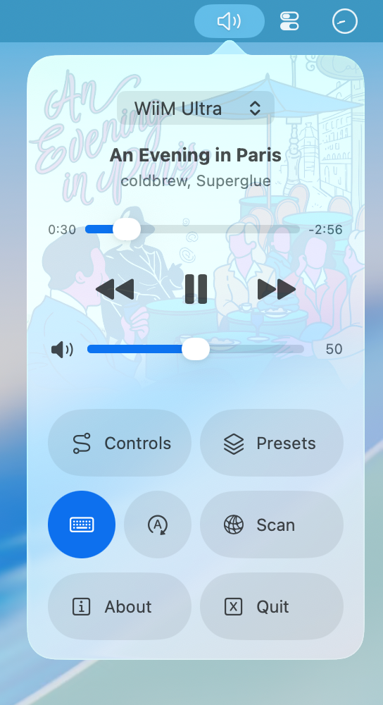
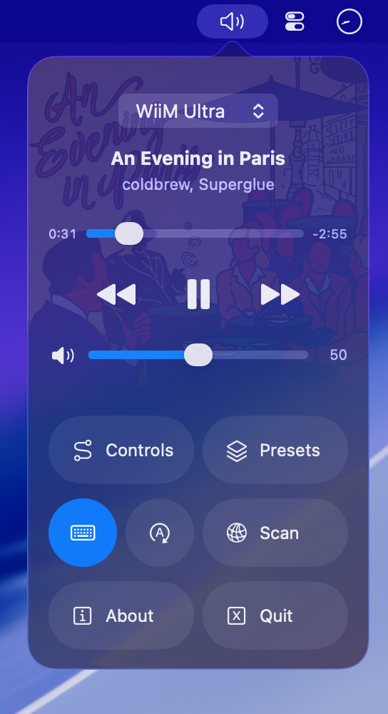

# Local Audio Remote Controller for WiiM/Linkplay (macOS)

Larc lives in your mac's menu bar and controls network audio streamers.

<p align="center">
  <a href="docs/example-1-light.png">
    <picture>
      <source media="(prefers-color-scheme: dark)" srcset="docs/example-1-dark.png">
      
    </picture>
  </a>
</p>
<p align="center"><sub><b>The popover tones its appearance by sampling the album art</b></sub></p>

<details>
<summary><b>More screenshots</b></summary>
<br>

<table>
  <tr>
    <td align="center">
      <a href="docs/1-optical.png"></a>
      <br><sub>Smart logic for passthrough inputs</sub>
    </td>
    <td align="center">
      <a href="docs/2-controls.png"></a>
      <br><sub>Control options</sub>
    </td>
    <td align="center">
      <a href="docs/3-presets.png"></a>
      <br><sub>Pair outputs with room corrections</sub>
    </td>
  </tr>
</table>

</details>

<details>
<summary><b>Light and dark</b></summary>
<br>

<table>
  <tr>
    <td align="center">
      <a href="docs/example-2-light.png"></a>
      <br><sub>Light</sub>
    </td>
    <td align="center">
      <a href="docs/example-2-dark.png"></a>
      <br><sub>Dark</sub>
    </td>
  </tr>
</table>

</details>

## Features

- Volume, mute, play/skip in the menu bar
- Media keys reach the WiiM or the mac (using smart logic<sup>1</sup>)
- Presets: switch output, input, volume instantly<sup>2</sup>
- Automatic discovery, everything local, no accounts
- Open source, macOS 14+

<sub><sup>1</sup> For example, if the wiim's input is set to "optical", track controls will automatically forward to the mac (even if media keys are enabled)</sub>

<sub><sup>2</sup> This means multiple pairs of speakers and their room correction profile can be quick swapped on the same wiim.</sub>

## Hotkeys

- `cmd+ctrl+l` (L for larc) toggles the popover
- `shift+/` (?) toggles hints for main screen controls

## Discuss

- [WiiM Community Forums](https://forum.wiimhome.com/threads/larc-is-a-free-menu-bar-app-for-wiim-macos.10193/)
- [Reddit.com/r/WiiM](https://www.reddit.com/r/wiim/comments/1vpx9n8/larc_is_a_free_menu_bar_app_for_wiim_macos/)

## Install

Requirements:

- macOS 14 Sonoma or later (Universal: Apple Silicon + Intel)
- A WiiM or other Linkplay-based streamer on the same network

Download:

- Grab the latest `Larc-x.y.z.dmg` from
  [Releases](https://github.com/bhajneet/larc/releases)
- Open the `.dmg` and drag
  `Larc.app` onto the `Applications` shortcut.
- NB: It isn't signed with an Apple Developer ID, so macOS refuses to open it.

How to open it anyway:

- Double-click `Larc.app`. System refuses. Dismiss the dialog.
- Go into System Settings → Privacy & Security and scroll down.
- Then click `Open Anyway` next to the message about Larc.

Alternate method using terminal:

```bash
xattr -d com.apple.quarantine /Applications/Larc.app
```

Onboarding:

- There are two permissions the app requests for network and media keys.
- **[required]** Without the network permission, this app cannot find devices or function at all.
- **[optional]** With media keys permission, it can still be toggled on/off in the menu (using the keyboard icon, shown in screenshots).

## Build

Building from source avoids developer signing issues. Locally built apps are never
quarantined, so nothing blocks them. This section is for other developers.

<details>
<summary>Build instructions</summary>
<br>

> Swift toolchain requirement (`swiftc`, `lipo`). If you have Xcode, you don't need to install the command-line tools separately. Either one works:
>
> - Xcode (full IDE app, over 20 GB)
> - Command Line Tools for Xcode (terminal based, around 1-2 GB)
>
> macOS keys the Local Network and Accessibility grants to the signature/bundle ID. And an ad-hoc signature changes every build, so every rebuild silently revokes both. System Settings keeps showing Larc as enabled, even though the check fails.
>
> Sign with stable identity:
>
> - Keychain Access → Certificate Assistant → Create a Certificate…
> - Name it `larc-dev`, Identity Type: Self-Signed Root, Certificate Type: Code Signing
> - Find it in Keychain Access → Get Info → Trust → set to **Always Trust**
>
> Build:
>
> - Clone repo (e.g. `git clone https://github.com/bhajneet/larc.git`)
> - Run `build.sh` (automatically picks up cert to persist the permission grants)
> - Outputs at `build/Larc.app`
>
> Confirm signature:
>
> - Use `codesign -dvvv build/Larc.app 2>&1` and look for `Authority=larc-dev` instead of `(unavailable)`.
>
> Reset Bundle ID grants:
>
> - Running `tccutil reset All` caused my machine to freeze up every time, so recommended to avoid that catch-all.
> - For Accessibility can run `tccutil reset Accessibility com.studioaiyo.larc`, then grant again.
> - No per-service reset exists for Local Network grants. Instead, use throwaway bundle IDs like `com.studioaiyo.larc.dev2`, `... .dev3`, etc. in `build.sh` and `larc.xcodeproj` to treat as a new app with an unseen ID and brand new permission grants.

</details>

## Releases

Version history is in [RELEASES.md](RELEASES.md).

## Roadmap

Also planned: Sparkle auto-updates, signed/notarized releases.

Also possible: track queues, URLs to play custom radios/streams.

## Device plugins

- ✅ shipped
- ⬜ potentially
- ❌ no local control

|     | Hardware/Backend        | Protocol   | Discovery |
| :-: | ----------------------- | ---------- | --------- |
| ✅  | WiiM / Linkplay         | HTTP       | mDNS      |
| ⬜  | BluOS (Bluesound, NAD)  | HTTP/XML   | mDNS      |
| ⬜  | Yamaha MusicCast        | HTTP/JSON  | SSDP      |
| ⬜  | Lyrion/LMS (Squeezebox) | JSON-RPC   | mDNS      |
| ⬜  | Jellyfin (sessions)     | HTTP       | UDP 7359  |
| ⬜  | Plex (clients)          | HTTP       | GDM       |
| ⬜  | OpenSubsonic (jukebox)  | HTTP       | manual    |
| ⬜  | Denon/Marantz HEOS      | TCP        | SSDP      |
| ⬜  | Sonos                   | UPnP       | SSDP      |
| ⬜  | Google Cast             | protobuf   | mDNS      |
| ⬜  | Roon                    | WebSocket  | Roon Core |
| ❌  | Apple TV/HomePod        | closed     | —         |
| ❌  | Amazon Echo             | cloud only | —         |

Expand to read different notes about the devices listed above.

<details>
<summary>Hardware/Backend Notes</summary>
<br>

- LMS, Jellyfin, Plex, OpenSubsonic should be fairly easy to do in terms of the API, but they are all programs that can be used on hardware simultaneously. Meaning one music server could be running them all. Which goes against our current IP address / MAC address list. Small rewrite to fix probably.
- Denon/Marantz HEOS seems like a persistent TCP socket with an async event stream. Current plugin model is request/response, so this would require connection lifecycle, reconnect, and keepalive.
- Sonos UPnP/SOAP means XML envelopes across several services (AVTransport, RenderingControl), and the zone model is the real question mark ("set volume" depends on whether the speaker is a group coordinator or a member).
- Google cast protobuf over TLS with custom framing, no HTTP anywhere, seems more difficult to implement than it's worth.
- Roon is not a device API, would have to register as an extension, and also has potentially confusing zones/outputs similar to Sonos. That's why it's last on the list.
- Google Cast and Roon both require dependencies to be baked into the app (which not everyone might use), so questioning whether it's bloat and or necessity for many people.
- Bose SoundTouch should be easy, but it's discontinued, and I don't know how popular it is, so I left it off the list.

</details>
